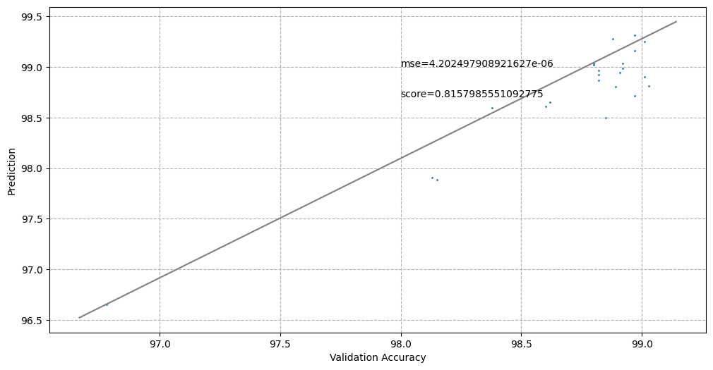

# LeNet Accuracy Predictor


## Requirments  
- PyTorch >= 1.5.1  
- scikit-learn 
- Brevitas(A Pytorch library for quantization-aware training)
```
$pip install git+https://github.com/Xilinx/brevitas.git
```
## Usage
```
$git clone https://github.com/Euphoria16/lenet-accuracy-predictor.git 
$cd lenet-accuracy-predictor  
$python lenet_train.py  
$python regression.py
```

## Result

